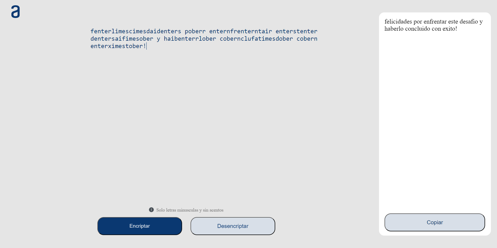

# Text Encryptor and Decryptor

Welcome to the Text Encryptor and Decryptor! This web page allows you to encrypt and decrypt texts based on specific key rules. It is responsive and adapts to different resolutions. The page also features a button to copy the converted text to the clipboard. The project is built using only HTML, CSS, and JavaScript.

## Features

- **Encrypt Text**: Transform your text based on predefined key rules.
- **Decrypt Text**: Revert your text to its original form using the same key rules.
- **Responsive Design**: The page is designed to be responsive and works well on different screen sizes.
- **Copy to Clipboard**: Easily copy the converted text with a single click.

## Key Rules

The text transformations are based on the following key rules:


```
const KEYS_RULES = {
    "a": "ai",
    "e": "enter",
    "i": "imes",
    "o": "ober",
    "u": "ufat"
};
```

## Usage
### Encrypting Text:

- Enter the text you want to encrypt in the provided text area.
- Click the "Encrypt" button to transform the text based on the key rules.
### Decrypting Text:

- Enter the encrypted text in the provided text area.
- Click the "Decrypt" button to revert the text to its original form.
### Copying Text:
- After converting the text, click the "Copy" button to copy the result to your clipboard.
### Technologies Used
- HTML
- CSS
- JavaScript

## How to Run
### 1. Clone the repository to your local machine:

```
git clone https://github.com/JorgeMiranda2/Basic-Decrypter.git
```
### 2. Navigate to the project directory:

```
cd Basic-Decrypter
```
### 3. Open the index.html file in your preferred web browser.

## Example


